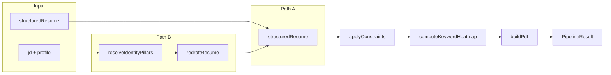

# Implement runPipeline (Brain, Eyes, Hands)

## Goal

Implement [packages/core/src/pipeline/run-pipeline.ts](packages/core/src/pipeline/run-pipeline.ts) so that:

- **Direct JSON path:** When `input.structuredResume` is provided, skip ingestion and redraft; run applyConstraints, computeKeywordHeatmap, and buildPdf.
- **JD Redraft path:** When `input.jd` is provided, resolve identity via `resolveIdentityPillars(input.profile)` and call `redraftResume(input.jd, pillars)` to obtain a structured resume.
- **Common pipeline:** Both paths converge on layout-prep (applyConstraints then computeKeywordHeatmap) and buildPdf, returning a `PipelineResult` with `pdf`, `layoutPrep` (including optional `keywordHeatmap`), and `warnings`.

## Codebase facts (must match)

- **PipelineResult** ([packages/types/src/pipeline-result.ts](packages/types/src/pipeline-result.ts)): `{ pdf: Buffer, layoutPrep: LayoutPrepMetadata, canva?: ..., warnings: PipelineWarning[] }`. No top-level `heatmap` or `structuredResume`; heatmap lives in `layoutPrep.keywordHeatmap`.
- **applyConstraints** ([packages/core/src/layout-prep/apply-constraints.ts](packages/core/src/layout-prep/apply-constraints.ts)): `(resume, contract) => ConstraintResult` with `{ resume, metadata }`. `metadata` is `LayoutPrepMetadata` (truncatedFields, truncationDetails, hadTrunciation) but does **not** include `keywordHeatmap`; the pipeline must merge it in.
- **computeKeywordHeatmap** ([packages/core/src/layout-prep/keyword-heatmap.ts](packages/core/src/layout-prep/keyword-heatmap.ts)): `(resume, jdKeywords: TieredKeyword[]) => { keywordHeatmap }`. Expects **tiered keywords from the JD**, not the raw JD string. For Direct JSON path there is no JD, so pass `[]`. For JD path, keyword extraction is not yet implemented; pass `[]` for now so the heatmap is empty (can be extended later when redraft or a separate step returns keywords).
- **buildPdf** ([packages/core/src/rendering/pdf/build-pdf.ts](packages/core/src/rendering/pdf/build-pdf.ts)): `(resume: StructuredResume, heatmap: KeywordHeatmap) => Promise<Buffer>`. Must receive the **constrained** resume (output of applyConstraints) and the keyword heatmap.
- **Template contract:** Use [packages/core/src/contract/mvp-template.ts](packages/core/src/contract/mvp-template.ts) `MVP_TEMPLATE_CONTRACT` when calling applyConstraints.
- **redraft.ts** ([packages/core/src/ai/redraft.ts](packages/core/src/ai/redraft.ts)): Currently exports a CLI-style `redraft()` that reads from file and calls `notify`. [packages/core/src/ai/index.ts](packages/core/src/ai/index.ts) exports `redraftResume` from redraft, but that symbol does not exist in redraft.ts, so the export is broken. The pipeline needs a callable `redraftResume(jd: string, pillars: IdentityPillars): Promise<StructuredResume>`.

## Implementation steps

### 1. Restore or add `redraftResume(jd, pillars)` in redraft.ts

- Add (or restore) `export async function redraftResume(_jd: string, _pillars: IdentityPillars): Promise<StructuredResume>`.
- For now, implementation can **throw** (e.g. "redraftResume: not implemented yet; BYOM Anthropic wiring pending") so that the JD path is **wired** but will fail at runtime until the API is integrated. Alternatively, return a fixture resume for local testing only.
- Import `IdentityPillars` from `@repo/types`. Keep any existing CLI `redraft()` logic separate (e.g. still callable via `--jd`/`--market` for scripts).

### 2. Implement runPipeline in run-pipeline.ts

- **Imports:** Use actual paths: `resolveIdentityPillars` from `../identity-defaults`; `applyConstraints` from `../layout-prep/apply-constraints`; `computeKeywordHeatmap` from `../layout-prep/keyword-heatmap`; `buildPdf` from `../rendering/pdf/build-pdf`; `redraftResume` from `../ai/redraft`; `MVP_TEMPLATE_CONTRACT` from `../contract/mvp-template`. Import types (PipelineResult, LayoutPrepMetadata, StructuredResume, IdentityPillars) from `@repo/types` as needed.
- **Path A (Direct JSON):** If `input.structuredResume` is set, use it as `structuredResume`.
- **Path B (JD Redraft):** If `input.jd` is set, `const pillars = resolveIdentityPillars(input.profile)`, then `structuredResume = await redraftResume(input.jd, pillars)`.
- **Else:** Throw a single error: e.g. "Pipeline requires either structuredResume or jd input."
- **Common pipeline:**
  - `constraintResult = applyConstraints(structuredResume, MVP_TEMPLATE_CONTRACT)`.
  - `jdKeywords`: for Path A use `[]`; for Path B use `[]` for now (no keyword extraction from JD yet).
  - `heatmapResult = computeKeywordHeatmap(constraintResult.resume, jdKeywords)`.
  - Build `layoutPrep: LayoutPrepMetadata = { ...constraintResult.metadata, keywordHeatmap: heatmapResult.keywordHeatmap }`.
  - `pdfBuffer = await buildPdf(constraintResult.resume, heatmapResult.keywordHeatmap)`.
  - Return `_makePipelineResult(pdfBuffer, layoutPrep)` (which already returns `{ pdf, layoutPrep, warnings: [] }`).
- **Canva:** Omit from this implementation. The architecture allows Canva to be added later; when added, call export after buildPdf and on failure append a warning instead of throwing.

### 3. Verification

- **Direct JSON path:** Call `runPipeline({ structuredResume: CANONICAL_RESUME })` and assert a non-empty `pdf` buffer and `layoutPrep` with `keywordHeatmap` (empty sections when jdKeywords is []). This can be done in the existing [packages/core/**tests**/pipeline.integration.test.ts](packages/core/__tests__/pipeline.integration.test.ts) by implementing the todo "runPipeline: returns PipelineResult with pdf buffer on success" and optionally "runPipeline: layoutPrep.hadTruncation is false when no fields exceed limits" using a resume that fits within the contract.
- Run `bash scripts/verify.sh` to ensure tests and layout simulation still pass.

## Flow summary

## Out of scope for this plan

- Implementing the Anthropic call inside `redraftResume` (BYOM API wiring).
- Extracting tiered keywords from the JD for the heatmap on the JD path (can be added later; heatmap will be empty for JD path until then).
- Canva export (add in a follow-up with non-fatal warning on failure).

