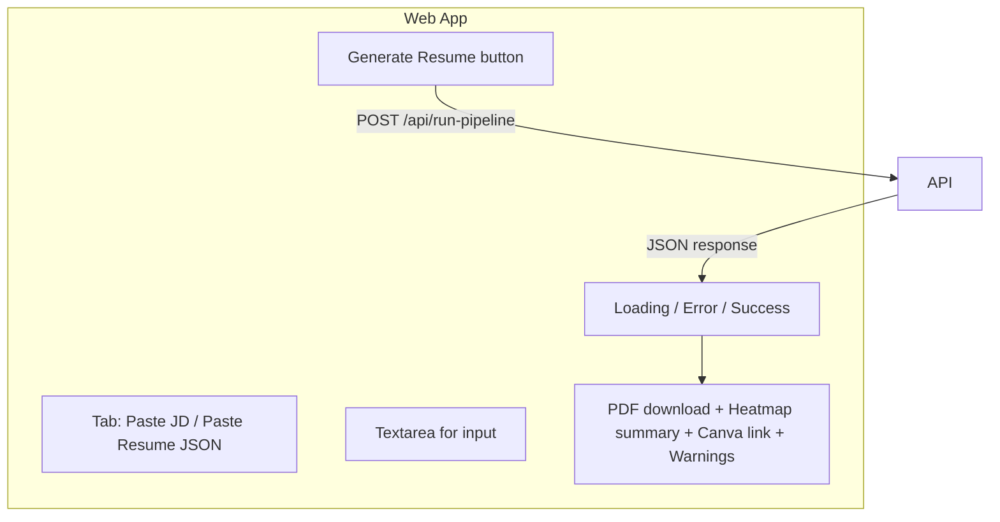

# Web Pipeline UI

## Current state

- The web app is a Vite SPA using vanilla TypeScript with HTML-string components (no framework). Layout lives in [apps/web/src/main.ts](apps/web/src/main.ts), styles in [apps/web/src/style.css](apps/web/src/style.css).
- [apps/web/src/api.ts](apps/web/src/api.ts) already exports `buildPipelineHeaders()` (includes Claude Pro token) and `buildPipelineProfile()` (returns `{ targetMarket }`) but nothing calls the API yet.
- The API at [apps/api/src/index.ts](apps/api/src/index.ts) has `POST /api/run-pipeline` which accepts `PipelineInput` (`{ jd?, structuredResume?, profile? }`) and returns JSON `{ pdf (base64), layoutPrep, canva?, warnings }`.
- The JD redraft path will fail at runtime (`redraftResume` throws "not implemented yet") but should still be wired with graceful error handling so the flow is ready when the AI is connected.

## What to build

A new "Generate Resume" card in the web app, placed between Settings and the Counter card, with two input modes, a run button, and a results area.




---

## 1. New file: `apps/web/src/pipeline.ts`

Create a new module that owns the pipeline UI rendering and logic. Pattern: export `renderPipeline()` (returns HTML string) and `attachPipelineListeners(root)` (attaches event handlers), same pattern as `settings.ts`.

**HTML structure** (returned by `renderPipeline()`):

- Section with heading "Generate Resume"
- Two tab buttons: "Paste JD" (default) and "Paste Resume JSON"
- A `<textarea>` with placeholder that changes per mode
- A "Generate Resume" button (disabled when textarea is empty or pipeline is running)
- A results area (initially hidden):
  - Status text (loading spinner text, error, success)
  - PDF download link (created from base64 via `URL.createObjectURL`)
  - Keyword heatmap summary: score, present/missing counts
  - Canva link (if `canva.url` is returned; shows `designId` otherwise)
  - Warnings list (if any, e.g. `CANVA_EXPORT_FAILED`)

**Logic** (in `attachPipelineListeners()`):

- Tab switching: toggles active class, swaps textarea placeholder, stores current mode (`'jd'` | `'json'`)
- Generate button click handler:
  1. Disable button, show "Generating..." status
  2. Build request body based on mode:
    - JD mode: `{ jd: textareaValue, profile: buildPipelineProfile() }`
    - JSON mode: Parse textarea as JSON, use as `{ structuredResume: parsed, profile: buildPipelineProfile() }`; catch parse errors and show inline error
  3. `fetch` to `${getApiBaseUrl()}/api/run-pipeline` with `buildPipelineHeaders()`, `credentials: 'include'`, body as JSON
  4. On success (200): decode `pdf` from base64, create a Blob, generate object URL, show download link + open-in-tab link; render heatmap summary from `layoutPrep.keywordHeatmap`; render Canva result; render warnings
  5. On error (4xx/5xx or network): show error message from response body or fallback; re-enable button
  6. Guard: if `getApiBaseUrl()` is empty, disable the Generate button and show a hint to set `VITE_API_URL`

---

## 2. Update `apps/web/src/api.ts`

Add a `runPipeline(body)` function that encapsulates the fetch call:

```typescript
export interface PipelineResponse {
  pdf: string;        // base64
  layoutPrep: { keywordHeatmap?: { score: number; present: string[]; missing: string[] } };
  canva?: { designId: string; url?: string };
  warnings: { code: string; message: string }[];
}

export async function callRunPipeline(body: Record<string, unknown>): Promise<PipelineResponse> {
  const res = await fetch(`${getApiBaseUrl()}/api/run-pipeline`, {
    method: 'POST',
    headers: buildPipelineHeaders(),
    credentials: 'include',
    body: JSON.stringify(body),
  });
  if (!res.ok) {
    const err = await res.json().catch(() => ({ message: 'Pipeline request failed' }));
    throw new Error(err.message || `HTTP ${res.status}`);
  }
  return res.json();
}
```

---

## 3. Update `apps/web/src/main.ts`

- Import `renderPipeline` and `attachPipelineListeners` from `./pipeline`
- Insert `${renderPipeline()}` between `${renderSettings()}` and the Counter card
- Call `attachPipelineListeners(app)` after `attachSettingsListeners(app)`

---

## 4. Add styles to `apps/web/src/style.css`

New CSS for the pipeline section:

- `.pipeline` card layout (same `.card` class)
- `.pipeline-tabs` — flex row for tab buttons, with `.active` styling matching `.toggle-btn.active`
- `.pipeline textarea` — full width, ~8 rows, monospace for JSON mode
- `.pipeline-status` — status text area
- `.pipeline-results` — result container (hidden by default, shown on success)
- `.pipeline-result-item` — individual result row (PDF link, heatmap, Canva, warnings)
- `.pipeline-warnings` — warning list with amber/orange text
- `.pipeline-error` — red error text
- Disabled button style (opacity 0.5, cursor not-allowed)

---

## 5. PDF download helper

In `pipeline.ts`, a small helper to convert base64 to a downloadable blob URL:

```typescript
function base64ToBlobUrl(b64: string, mime: string): string {
  const bytes = Uint8Array.from(atob(b64), c => c.charCodeAt(0));
  return URL.createObjectURL(new Blob([bytes], { type: mime }));
}
```

Use this to create a download link (`<a href="..." download="resume.pdf">`) and an "Open PDF" link (`target="_blank"`).

---

## 6. Verification

- Run `bash scripts/verify.sh` to confirm no regressions
- Manual test: start API (`pnpm --filter api dev`) and web (`pnpm --filter web dev`), paste the canonical resume JSON from [packages/core/**tests**/fixtures/canonical-resume.ts](packages/core/__tests__/fixtures/canonical-resume.ts) into the "Paste Resume JSON" tab, click Generate, confirm PDF downloads successfully

